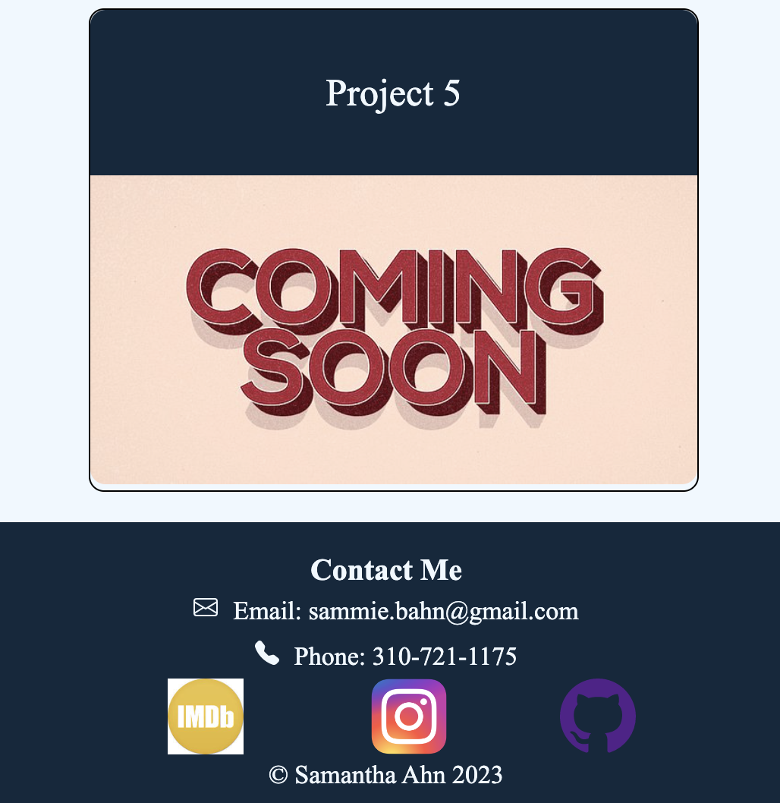

# sams-portfolio

## Description
This is a portfolio that showcases my work that I've completed and continue to create, as well as gives you a little insight into who I am and what I've accomplished. My motivation steamed from my desire to showcase my work which builds on my HTML and CSS knowledge. I created this project to give people and opportunity to look at my work and learn about me. This specifically solves my lack of knowledge surronding HTML and CSS. It helps me solidify what I learned and creates a foundation for me to add more complex skills. 

I learned how to create a webpage from start to finish so that it showcases my projects. It added onto my skillset surronding html and css. 

## Deploy link

## Installation

N/A

## Usage

The portfolio will allow you to click on the navigation sections and they will take you to its corisponding section in the webpage. It will also allow you to click on specific projects and it will take you to the deployed link on another page. 

## Credits

N/A

## License

N/A
